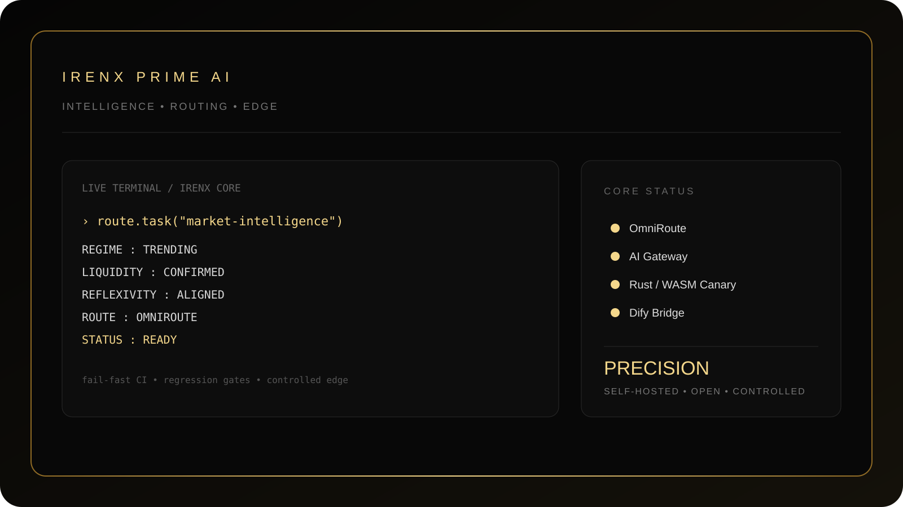
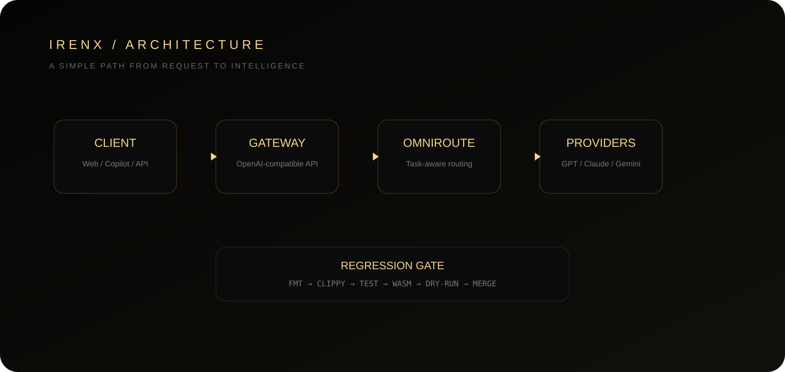

<div align="center">

# IRENX
### PRIME AI · OMNIROUTE · EDGE INTELLIGENCE

**A self-hosted AI intelligence gateway built for precision, control, and elegant simplicity.**

[](https://github.com/Intrvrt6/IRENX-ai/actions)
[](LICENSE)
[](rust/)
[](#deployment)

</div>

<p align="center">
  
</p>

> **IRENX is intentionally simple on the surface and disciplined underneath.**
> One gateway. One routing layer. Controlled integrations. Fail-fast CI. Regression gates before `main`.

---

## ✦ What is IRENX?

IRENX PRIME AI is a **self-hosted AI gateway and intelligence terminal** combining:

- **OmniRoute Core Router V2** — task-aware provider routing, scoring, budget guards, timeout and circuit-breaker logic.
- **OpenAI-compatible gateway** — designed for OmniCopilot and compatible clients.
- **Dify bridge** — server-side workflows and chat integration.
- **Live market layer** — normalized market data endpoints for supported symbols.
- **Cloudflare Rust/WASM canary** — isolated edge runtime, promoted only after verification.
- **Fail-fast CI + regression gates** — broken changes stop before they reach `main`.
- **Self-hosted deployment** — Bun + Docker + Caddy, with no dependency on Vercel.

### Design language

**Black. Gold. Quiet. Precise.**

The repository intentionally favors a premium, minimal visual identity instead of a crowded dashboard aesthetic.

---

## ◈ Architecture

<p align="center">
  
</p>

```text
Client
  │
  ▼
Public API / OpenAI-compatible Gateway
  │
  ▼
IRENX Core Router V2
  │
  ▼
OmniRoute
  │
  ├── GPT
  ├── Claude
  ├── Gemini
  ├── Qwen
  ├── DeepSeek
  └── other providers

Optional integrations
  ├── Dify
  ├── MCP
  └── Rust/WASM edge canary
```

### Runtime authority

The TypeScript/Bun gateway remains the production authority. The Rust/WASM worker is a **controlled canary**, not an automatic replacement.

Promotion requires the relevant quality and runtime checks to pass.

---

## ◇ Repository structure

```text
IRENX-ai/
├── index.html                 # PRIME terminal UI
├── api/                       # public API + AI gateway
│   └── v1/                    # OpenAI-compatible surface
├── src/omniroute/             # Core routing intelligence
├── mcp/                       # MCP integration surface
├── worker/                    # Cloudflare TypeScript worker
├── rust/                      # Rust/WASM edge canary
├── docs/                      # architecture + operations
│   └── assets/                # premium repository showcase graphics
├── .github/workflows/         # CI / governance / regression gates
├── Dockerfile                 # self-hosted image
├── docker-compose.yml         # production compose stack
├── Caddyfile                  # HTTPS reverse proxy
├── wrangler.toml              # Cloudflare configuration
└── deploy.sh                  # deployment + health checks
```

---

## ⚡ Fail-fast CI & regression gates

IRENX treats CI as a **merge boundary**, not a notification system.

```text
PR / PUSH
   │
   ├─ source / governance validation
   ├─ formatting
   ├─ lint / Clippy
   ├─ regression tests
   ├─ WASM build
   ├─ worker-build validation
   └─ Wrangler dry-run
          │
          ▼
       ALL PASS
          │
          ▼
      eligible for main
```

The principle is strict:

> **If a required check fails, downstream verification stops and the change is not production-ready.**

This prevents a formatting or compilation regression from being hidden behind later checks.

---

## ◎ API surface

| Endpoint | Purpose |
|---|---|
| `GET /api/health` | Market + AI gateway health |
| `GET /api/ai/health` | AI Core Router observability |
| `GET /api/ai/route?prompt=...` | Route-selection dry run |
| `POST /api/ai` | Task-aware AI request |
| `GET /api/v1/models` | OpenAI-compatible model catalog |
| `POST /api/v1/chat/completions` | OpenAI-compatible chat gateway |
| `GET /api/market?symbol=XAUUSD` | Normalized latest quote |
| `WS /api/ws` | Browser WebSocket stream |

Supported market symbols currently include `XAUUSD`, `EURUSD`, `GBPUSD`, `USDJPY`, and `NAS100`.

---

## ⌁ OmniRoute Core Router V2

IRENX adds an application-level policy layer in front of OmniRoute without duplicating OmniRoute's provider registry.

### Resilience

- Circuit breaker with cooldown and recovery probing.
- Request timeout.
- Provider fallback delegated to OmniRoute.
- Observability around routing decisions.

### Budget / quota guard

```text
IRENX_AI_BUDGET_USD=2
IRENX_AI_MAX_REQUESTS=0
IRENX_AI_MAX_TOKENS=0
IRENX_INPUT_USD_PER_1M=3
IRENX_OUTPUT_USD_PER_1M=15
IRENX_EST_OUTPUT_TOKENS=1200
```

`0` means unlimited for request/token quotas.

---

## ◇ OmniCopilot

```text
VS Code / Copilot Chat
        │
        ▼
   OmniCopilot
        │
        ▼
https://ai.irenx.com/api/v1
        │
        ▼
 IRENX Core Router
        │
        ▼
    OmniRoute
```

By default, `IRENX_COPILOT_RESPECT_MODEL=0`, allowing IRENX to classify the workload and select a route family. Set it to `1` to respect the model selected by the client.

---

## ◇ Dify

IRENX provides a server-side Dify bridge:

- `GET /api/dify/health`
- `POST /api/dify/workflows/run`
- `POST /api/dify/chat-messages`

Dify remains an external/self-hosted application engine.

---

## Deployment

IRENX is designed for a normal Linux VPS/server using Docker and Caddy.

### Requirements

- Linux VPS/server
- Docker Engine
- Docker Compose plugin
- Ports `80/tcp` and `443/tcp`
- DNS `ai.irenx.com` → server IP

### Environment

```bash
cp .env.example .env
```

At minimum:

```text
OMNIROUTE_BASE_URL=http://127.0.0.1:20128
OMNIROUTE_API_KEY=...
TWELVEDATA_API_KEY=...
```

For Dify:

```text
DIFY_BASE_URL=http://dify-api:5001
DIFY_API_KEY=...
```

**Never commit `.env`, credentials, API keys, or provider secrets.**

### Start

```bash
bash deploy.sh
```

or:

```bash
docker compose up -d --build
```

### Verify

```bash
curl -fsS https://ai.irenx.com/api/health
curl -fsS https://ai.irenx.com/api/ai/health
```

---

## Security posture

IRENX follows a controlled architecture boundary:

- Credentials stay server-side.
- Public API access is separated from provider credentials.
- Rust/WASM is treated as a canary until verified.
- CI is designed to fail fast on regressions.
- Production deployment is self-hosted and explicit.

---

## ✦ Philosophy

```text
LESS NOISE.
MORE SIGNAL.

SIMPLE INTERFACE.
SERIOUS ENGINEERING.

FAST FAILURE.
SAFE PROMOTION.

ONE GATEWAY.
FULL CONTROL.
```

<div align="center">

### IRENX PRIME AI
**Precision over noise. Control over complexity.**

</div>
