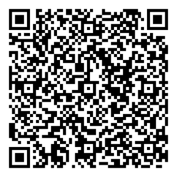

# ❤️ Support IRENX

## Bangun IRENX bersama

IRENX adalah project open-source yang dikembangkan untuk menggabungkan AI, MCP, developer tools, keamanan, otomasi, dan data real-time dalam satu platform yang modular.

Project ini dibuat agar teknologi yang biasanya terasa rumit bisa menjadi lebih mudah digunakan, dipelajari, dikembangkan, dan dibagikan.

### Kenapa project ini menarik?

- **AI Routing** — menghubungkan dan memilih kemampuan AI sesuai kebutuhan.
- **MCP Tools** — membuka akses AI ke data, API, library, cloud, dan tools eksternal.
- **Security First** — RBAC, policy enforcement, audit, secret management, observability, dan supply-chain security menjadi bagian dari arah platform.
- **Real-time Data** — integrasi data pasar dan layanan eksternal untuk analisis berbasis evidence.
- **Open & Modular** — arsitektur dibuat agar dapat diperluas tanpa mengunci seluruh sistem pada satu provider.
- **Developer Friendly** — fokus pada tools, integrasi, automation, testing, dan infrastruktur yang dapat dikembangkan bersama komunitas.

## Donasi QRIS

Kalau kamu merasa IRENX bermanfaat dan ingin membantu project ini terus berkembang, kamu bisa memberikan dukungan melalui QRIS berikut.

**Penerima:** EVANESCET, DIGITAL & KREATIF  
**NMID:** `ID1026498341662`

Dukungan dapat membantu biaya pengembangan, server/infrastruktur, keamanan, riset, testing, dokumentasi, dan pengembangan tools open-source.

> Dukungan bersifat sukarela. Terima kasih sudah ikut membantu IRENX berkembang.

## Repository

**GitHub:** https://github.com/Intrvrt6/IRENX-ai

Jika ingin membantu tanpa donasi, kontribusi melalui issue, bug report, documentation, testing, code review, atau pull request juga sangat berarti.

**OPEN SOURCE • OPEN FUTURE • BUILD TOGETHER**
